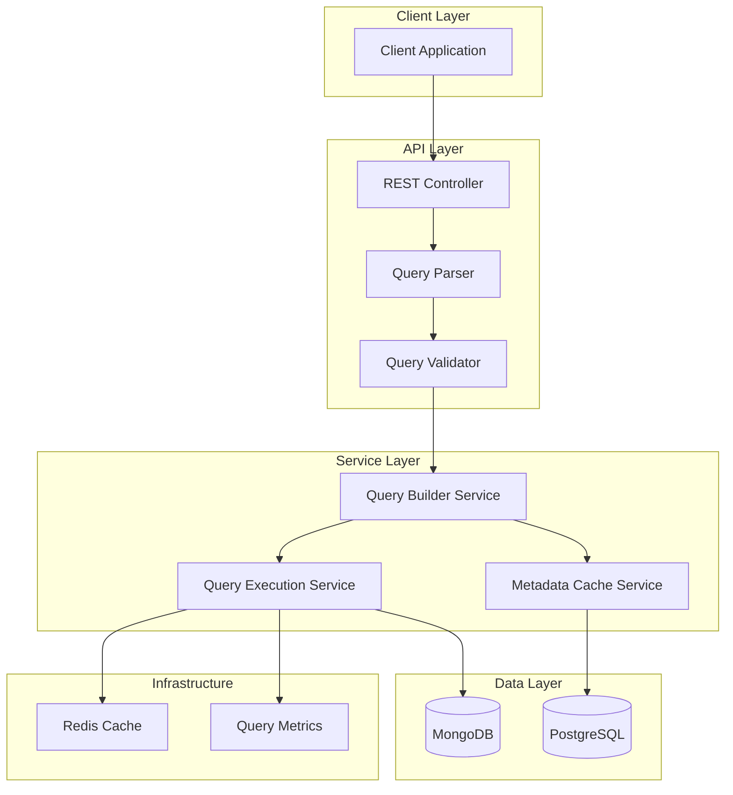
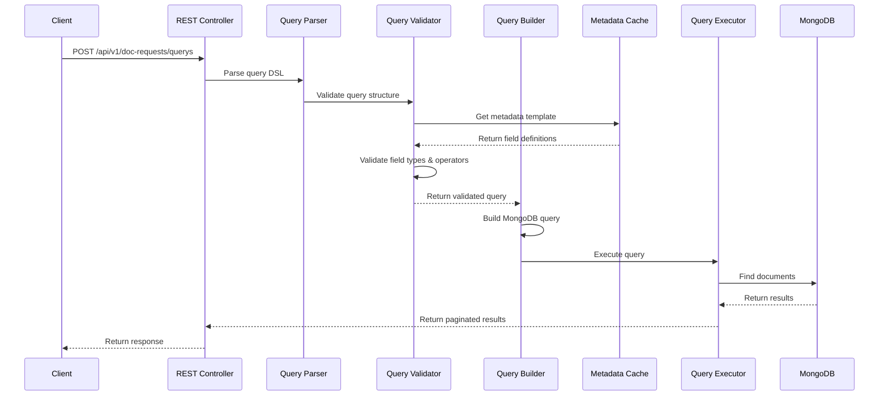
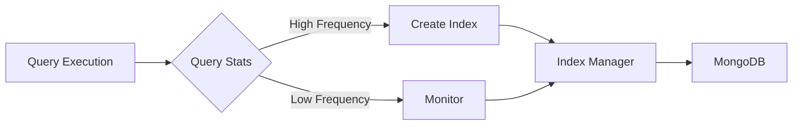
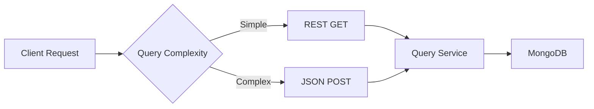
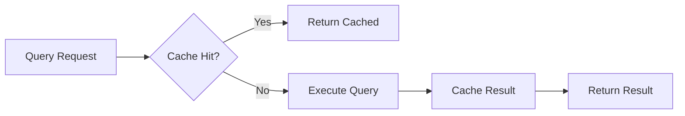
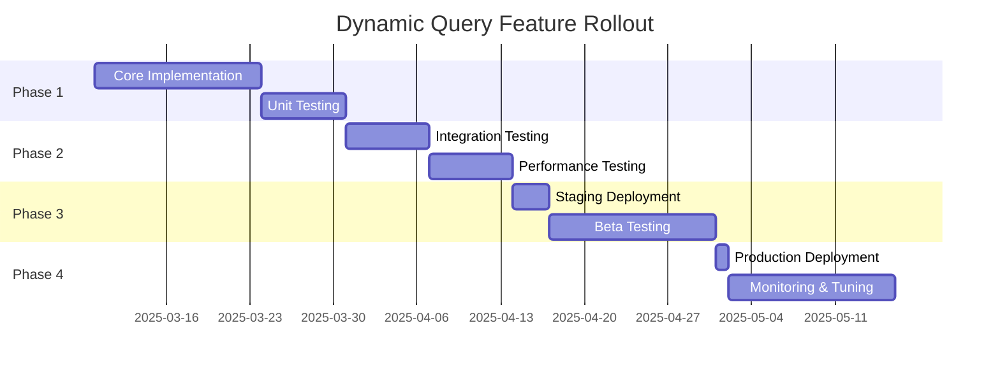

# Dynamic Query Feature Implementation Proposal

## DocRequest Metadata Filtering System

**Version:** 1.0  
**Date:** 2025-03-05  
**Status:** Design Proposal

---

## Executive Summary

This document outlines a comprehensive design for enabling dynamic querying of [`DocRequest`](api/src/main/java/br/com/docrequest/domain/document/DocRequest.java:32) entities with complex filtering on associated [`DocRequestMetadata`](api/src/main/java/br/com/docrequest/domain/entity/DocRequestMetadata.java:29) fields. The solution supports filtering by template names (e.g., "estudante") and complex conditional logic on metadata fields including equality checks, range comparisons, and various data types.

---

## Table of Contents

1. [Requirements Analysis](#requirements-analysis)
2. [System Architecture](#system-architecture)
3. [Database Schema Design](#database-schema-design)
4. [Indexing Strategy](#indexing-strategy)
5. [Query DSL Design](#query-dsl-design)
6. [API Architecture Comparison](#api-architecture-comparison)
7. [Implementation Components](#implementation-components)
8. [Security Considerations](#security-considerations)
9. [Performance Optimization](#performance-optimization)
10. [Testing Strategy](#testing-strategy)
11. [Migration Plan](#migration-plan)

---

## 1. Requirements Analysis

### 1.1 Functional Requirements

| ID    | Requirement                                                             | Priority |
| ----- | ----------------------------------------------------------------------- | -------- |
| FR-1  | Filter DocRequests by template name (e.g., "estudante")                 | High     |
| FR-2  | Support equality operators (=, !=) for all field types                  | High     |
| FR-3  | Support comparison operators (<, <=, >, >=) for numeric and date fields | High     |
| FR-4  | Support string matching operators (contains, startsWith, endsWith)      | Medium   |
| FR-5  | Support logical operators (AND, OR, NOT) for complex queries            | High     |
| FR-6  | Support array/list field queries (contains, size)                       | Medium   |
| FR-7  | Support null/empty checks                                               | Medium   |
| FR-8  | Support pagination and sorting                                          | High     |
| FR-9  | Maintain multi-tenant isolation (partId)                                | High     |
| FR-10 | Type-safe query construction                                            | High     |

### 1.2 Non-Functional Requirements

| ID    | Requirement                                        | Priority |
| ----- | -------------------------------------------------- | -------- |
| NFR-1 | Query response time < 500ms for indexed fields     | High     |
| NFR-2 | Support 10,000+ concurrent queries                 | High     |
| NFR-3 | Maintain backward compatibility with existing APIs | High     |
| NFR-4 | Provide comprehensive query validation             | Medium   |
| NFR-5 | Support query result caching                       | Medium   |
| NFR-6 | Provide query performance monitoring               | Medium   |

### 1.3 Supported Data Types

Based on [`DocRequestFieldType`](api/src/main/java/br/com/docrequest/domain/enums/DocRequestFieldType.java:7):

| Type              | Operators                                        | Notes                       |
| ----------------- | ------------------------------------------------ | --------------------------- |
| STRING            | =, !=, contains, startsWith, endsWith, in, notIn | Case-insensitive by default |
| INTEGER           | =, !=, <, <=, >, >=, in, notIn                   | Numeric comparison          |
| DOUBLE            | =, !=, <, <=, >, >=, in, notIn                   | Numeric comparison          |
| DATE              | =, !=, <, <=, >, >=, in, notIn                   | ISO 8601 format             |
| DATETIME          | =, !=, <, <=, >, >=, in, notIn                   | ISO 8601 format             |
| EXPIRATION_DATE   | =, !=, <, <=, >, >=, in, notIn                   | ISO 8601 format             |
| BOOLEAN           | =, !=                                            | true/false values           |
| CPF               | =, !=                                            | String equality             |
| EMAIL             | =, !=, contains                                  | String operations           |
| EMAIL_ALTERNATIVE | =, !=, contains                                  | String operations           |
| LIST_STRING       | contains, size, isEmpty                          | Array operations            |
| LIST_INT          | contains, size, isEmpty                          | Array operations            |
| LIST_DOUBLE       | contains, size, isEmpty                          | Array operations            |
| NAME              | =, !=, contains                                  | String operations           |
| PROFILES          | contains, size, isEmpty                          | Array operations            |

---

## 2. System Architecture

### 2.1 High-Level Architecture



### 2.2 Component Responsibilities

| Component               | Responsibility                                                |
| ----------------------- | ------------------------------------------------------------- |
| REST Controller         | Expose query endpoints, handle HTTP requests/responses        |
| Query Parser            | Parse query DSL into internal representation                  |
| Query Validator         | Validate query structure, field existence, type compatibility |
| Query Builder Service   | Build MongoDB queries from parsed representation              |
| Metadata Cache Service  | Cache DocRequestMetadata templates for field type lookup      |
| Query Execution Service | Execute queries, handle pagination, apply tenant isolation    |
| MongoDB                 | Store and query DocRequest documents                          |
| PostgreSQL              | Store DocRequestMetadata templates                            |
| Redis Cache             | Cache frequent query results                                  |
| Query Metrics           | Track query performance and usage patterns                    |

### 2.3 Query Processing Flow



---

## 3. Database Schema Design

### 3.1 Current Schema Analysis

The current [`DocRequest`](api/src/main/java/br/com/docrequest/domain/document/DocRequest.java:32) schema:

```java
@Document(collection = "doc_requests")
public class DocRequest {
    @Id
    private String id;

    @Indexed
    private String uuid;

    @Indexed
    private String partId;  // Tenant ID

    @Field("docRequestMetadataName")
    private String docRequestMetadataName;

    @Field("docRequestMetadataVersion")
    private int docRequestMetadataVersion;

    @Field("fields")
    private Map<String, Object> fields;  // Dynamic fields

    @CreatedDate
    private LocalDateTime createdAt;

    @LastModifiedDate
    private LocalDateTime updatedAt;
}
```

### 3.2 Schema Enhancements

No schema changes required for MongoDB. The existing dynamic `fields` map structure is sufficient for flexible querying.

### 3.3 Metadata Query Index Collection (Optional)

For advanced query optimization, consider creating a separate collection to track frequently queried fields:

```javascript
// doc_request_query_stats (optional)
{
  "_id": ObjectId("..."),
  "partId": "tenant-123",
  "metadataName": "estudante",
  "fieldName": "birth_date",
  "fieldType": "DATE",
  "queryCount": 15000,
  "lastQueriedAt": ISODate("2025-03-05T10:00:00Z"),
  "avgQueryTimeMs": 45,
  "indexed": true
}
```

---

## 4. Indexing Strategy

### 4.1 Existing Indexes

Current compound indexes on [`DocRequest`](api/src/main/java/br/com/docrequest/domain/document/DocRequest.java:23):

```java
@CompoundIndex(name = "idx_part_id_metadata_name", def = "{'partId': 1, 'docRequestMetadataName': 1}")
@CompoundIndex(name = "idx_part_id_created_at", def = "{'partId': 1, 'createdAt': -1}")
```

### 4.2 Recommended Indexes (Ignore for now, will be implemented in future)

#### 4.2.1 Template-Specific Dynamic Indexes

For each template with high query volume, create dynamic field indexes:

```javascript
// For "estudante" template
db.doc_requests.createIndex(
  { partId: 1, docRequestMetadataName: 1, "fields.birth_date": 1 },
  {
    name: "idx_estudante_birth_date",
    partialFilterExpression: { docRequestMetadataName: "estudante" },
  },
);

db.doc_requests.createIndex(
  { partId: 1, docRequestMetadataName: 1, "fields.is_active": 1 },
  {
    name: "idx_estudante_is_active",
    partialFilterExpression: { docRequestMetadataName: "estudante" },
  },
);
```

#### 4.2.2 Multi-Field Compound Indexes

For common query patterns:

```javascript
// Template + date range queries
db.doc_requests.createIndex(
  {
    partId: 1,
    docRequestMetadataName: 1,
    "fields.birth_date": 1,
    createdAt: -1,
  },
  {
    name: "idx_template_date_created",
    partialFilterExpression: { docRequestMetadataName: "estudante" },
  },
);

// Template + boolean + date queries
db.doc_requests.createIndex(
  {
    partId: 1,
    docRequestMetadataName: 1,
    "fields.is_active": 1,
    "fields.birth_date": 1,
  },
  {
    name: "idx_template_active_date",
    partialFilterExpression: { docRequestMetadataName: "estudante" },
  },
);
```

#### 4.2.3 Text Index for String Fields

For full-text search on string fields:

```javascript
db.doc_requests.createIndex(
  {
    partId: 1,
    docRequestMetadataName: 1,
    "fields.name": "text",
    "fields.email": "text",
  },
  {
    name: "idx_estudante_text_search",
    partialFilterExpression: { docRequestMetadataName: "estudante" },
  },
);
```

### 4.3 Index Management Strategy (Ignore for now, will be implemented in future)



**Index Management Rules:**

1. **Automatic Index Creation**: Create indexes for fields queried > 1000 times/day
2. **Partial Indexes**: Use partial filter expressions to reduce index size
3. **Index Expiration**: Remove indexes unused for > 30 days
4. **Index Monitoring**: Track index usage and query performance
5. **Tenant Isolation**: Always include `partId` in compound indexes

### 4.4 Index Performance Considerations (Ignore for now, will be implemented in future)

| Factor               | Recommendation                                 |
| -------------------- | ---------------------------------------------- |
| Index Size           | Use partial indexes to reduce storage overhead |
| Write Performance    | Limit to < 10 indexes per template             |
| Query Selectivity    | Index high-selectivity fields first            |
| Compound Index Order | partId → metadataName → most selective field   |
| TTL Indexes          | Not applicable for DocRequest data             |

---

## 5. Query DSL Design

### 5.1 JSON-Based Query DSL

A flexible, type-safe JSON query language for complex filtering:

```json
{
  "templateName": "estudante",
  "filters": {
    "operator": "AND",
    "conditions": [
      {
        "field": "is_active",
        "operator": "eq",
        "value": true
      },
      {
        "field": "birth_date",
        "operator": "lt",
        "value": "2000-01-01"
      },
      {
        "operator": "OR",
        "conditions": [
          {
            "field": "email",
            "operator": "contains",
            "value": "@gmail.com"
          },
          {
            "field": "email",
            "operator": "contains",
            "value": "@yahoo.com"
          }
        ]
      }
    ]
  },
  "pagination": {
    "page": 0,
    "size": 20,
    "sort": [
      {
        "field": "birth_date",
        "direction": "ASC"
      }
    ]
  }
}
```

### 5.2 Supported Operators

| Operator     | Description             | Data Types              |
| ------------ | ----------------------- | ----------------------- |
| `eq`         | Equals                  | All types               |
| `ne`         | Not equals              | All types               |
| `gt`         | Greater than            | Numeric, Date, DateTime |
| `gte`        | Greater than or equal   | Numeric, Date, DateTime |
| `lt`         | Less than               | Numeric, Date, DateTime |
| `lte`        | Less than or equal      | Numeric, Date, DateTime |
| `contains`   | Contains substring      | String                  |
| `startsWith` | Starts with             | String                  |
| `endsWith`   | Ends with               | String                  |
| `in`         | In list                 | All types               |
| `notIn`      | Not in list             | All types               |
| `isNull`     | Is null                 | All types               |
| `isNotNull`  | Is not null             | All types               |
| `isEmpty`    | Is empty (array/string) | Array, String           |
| `isNotEmpty` | Is not empty            | Array, String           |
| `contains`   | Contains element        | Array                   |
| `size`       | Array size              | Array                   |
| `sizeEq`     | Array size equals       | Array                   |
| `sizeGt`     | Array size greater than | Array                   |
| `sizeLt`     | Array size less than    | Array                   |

### 5.3 Logical Operators

| Operator | Description                         |
| -------- | ----------------------------------- |
| `AND`    | All conditions must be true         |
| `OR`     | At least one condition must be true |
| `NOT`    | Negates the condition               |

### 5.4 Query Examples

#### Example 1: Simple Equality Query

```json
{
  "templateName": "estudante",
  "filters": {
    "operator": "AND",
    "conditions": [
      {
        "field": "is_active",
        "operator": "eq",
        "value": true
      }
    ]
  }
}
```

#### Example 2: Date Range Query

```json
{
  "templateName": "estudante",
  "filters": {
    "operator": "AND",
    "conditions": [
      {
        "field": "birth_date",
        "operator": "gte",
        "value": "1990-01-01"
      },
      {
        "field": "birth_date",
        "operator": "lte",
        "value": "2000-12-31"
      }
    ]
  }
}
```

#### Example 3: Complex Nested Query

```json
{
  "templateName": "estudante",
  "filters": {
    "operator": "AND",
    "conditions": [
      {
        "field": "is_active",
        "operator": "eq",
        "value": true
      },
      {
        "operator": "OR",
        "conditions": [
          {
            "field": "grade",
            "operator": "in",
            "value": ["A", "B"]
          },
          {
            "operator": "AND",
            "conditions": [
              {
                "field": "attendance",
                "operator": "gte",
                "value": 90
              },
              {
                "field": "assignments_completed",
                "operator": "eq",
                "value": true
              }
            ]
          }
        ]
      }
    ]
  }
}
```

#### Example 4: Array Field Query

```json
{
  "templateName": "estudante",
  "filters": {
    "operator": "AND",
    "conditions": [
      {
        "field": "courses",
        "operator": "contains",
        "value": "Mathematics"
      },
      {
        "field": "courses",
        "operator": "sizeGt",
        "value": 3
      }
    ]
  }
}
```

#### Example 5: With Pagination and Sorting

```json
{
  "templateName": "estudante",
  "filters": {
    "operator": "AND",
    "conditions": [
      {
        "field": "is_active",
        "operator": "eq",
        "value": true
      }
    ]
  },
  "pagination": {
    "page": 0,
    "size": 50,
    "sort": [
      {
        "field": "last_name",
        "direction": "ASC"
      },
      {
        "field": "first_name",
        "direction": "ASC"
      }
    ]
  }
}
```

### 5.5 Type Safety

The query DSL enforces type safety through:

1. **Metadata Validation**: Query parser validates field existence and type from [`DocRequestMetadata`](api/src/main/java/br/com/docrequest/domain/entity/DocRequestMetadata.java:29)
2. **Operator Compatibility**: Validates operator compatibility with field type
3. **Value Type Checking**: Validates value type matches field type
4. **Compile-Time Safety**: Java DTOs with validation annotations

---

## 6. API Architecture Comparison

### 6.1 Comparison Matrix

| Aspect                     | REST Query Params | OData  | JSON-Based Search | GraphQL   |
| -------------------------- | ----------------- | ------ | ----------------- | --------- |
| **Ease of Implementation** | High              | Medium | High              | Medium    |
| **Client Integration**     | High              | Medium | High              | Medium    |
| **Query Complexity**       | Low               | High   | High              | Very High |
| **Type Safety**            | Low               | High   | Medium            | Very High |
| **Performance**            | High              | Medium | High              | Medium    |
| **Caching**                | High              | Medium | High              | Low       |
| **Security**               | High              | Medium | High              | Medium    |
| **Scalability**            | High              | Medium | High              | Medium    |
| **Documentation**          | High              | High   | High              | High      |
| **Learning Curve**         | Low               | High   | Low               | High      |
| **Flexibility**            | Low               | High   | High              | Very High |
| **Standardization**        | High              | High   | Low               | Medium    |

### 6.2 Detailed Analysis

#### 6.2.1 REST Query Parameters

**Pros:**

- Simple and widely understood
- Easy to implement with Spring Data
- Excellent caching support (URL-based)
- Good for simple queries
- Standard HTTP semantics

**Cons:**

- Limited expressiveness for complex queries
- URL length limitations
- Difficult to express nested logic
- No type safety
- Verbose for complex filters

**Example:**

```
GET /api/v1/doc-requests?templateName=estudante&fields.is_active=true&fields.birth_date[lt]=2000-01-01&page=0&size=20
```

#### 6.2.2 OData

**Pros:**

- Industry standard for querying
- Rich query capabilities
- Built-in filtering, sorting, paging
- Strong type system
- Metadata discovery

**Cons:**

- Complex implementation
- Steep learning curve
- Overkill for simple use cases
- Limited MongoDB support
- Performance overhead

**Example:**

```
GET /api/v1/doc-requests?$filter=docRequestMetadataName eq 'estudante' and fields/is_active eq true and fields/birth_date lt 2000-01-01&$orderby=fields/birth_date asc&$top=20&$skip=0
```

#### 6.2.3 JSON-Based Search

**Pros:**

- Flexible and expressive
- Easy to implement
- Good for complex queries
- Type-safe with validation
- No URL length limitations
- Easy to extend

**Cons:**

- Requires POST method (not cacheable by default)
- Less standard than REST
- Requires JSON parsing
- Slightly more complex client code

**Example:**

```http
POST /api/v1/doc-requests/query
Content-Type: application/json

{
  "templateName": "estudante",
  "filters": {
    "operator": "AND",
    "conditions": [
      {
        "field": "is_active",
        "operator": "eq",
        "value": true
      },
      {
        "field": "birth_date",
        "operator": "lt",
        "value": "2000-01-01"
      }
    ]
  },
  "pagination": {
    "page": 0,
    "size": 20
  }
}
```

#### 6.2.4 GraphQL

**Pros:**

- Extremely flexible
- Clients request exactly what they need
- Strong type system
- Single endpoint
- Excellent for complex nested queries

**Cons:**

- Complex implementation
- Steep learning curve
- Caching challenges
- N+1 query problems
- Overkill for this use case
- Limited MongoDB tooling

**Example:**

```graphql
query {
  docRequests(
    templateName: "estudante"
    filters: {
      operator: AND
      conditions: [
        { field: "is_active", operator: EQ, value: true }
        { field: "birth_date", operator: LT, value: "2000-01-01" }
      ]
    }
    pagination: { page: 0, size: 20 }
  ) {
    uuid
    fields {
      name
      email
      birth_date
    }
    createdAt
  }
}
```

### 6.3 Recommendation

**Recommended Approach: JSON-Based Search with REST Fallback**

**Rationale:**

1. **Primary: JSON-Based Search (POST)**
   - Best for complex queries with nested logic
   - No URL length limitations
   - Type-safe with validation
   - Easy to extend with new operators
   - Excellent for MongoDB dynamic queries

2. **Secondary: REST Query Parameters (GET)**
   - For simple, common queries
   - Better caching support
   - Easier for simple integrations
   - Backward compatible

3. **Hybrid Benefits:**
   - Flexibility for complex use cases
   - Simplicity for common operations
   - Gradual adoption path
   - Best of both worlds

**Implementation Strategy:**



---

## 7. Implementation Components

### 7.1 Core Components

#### 7.1.1 Query DSL DTOs

```java
// QueryRequest.java
package br.com.docrequest.dto.request;

import jakarta.validation.Valid;
import jakarta.validation.constraints.NotBlank;
import jakarta.validation.constraints.NotNull;
import lombok.AllArgsConstructor;
import lombok.Builder;
import lombok.Data;
import lombok.NoArgsConstructor;

@Data
@Builder
@NoArgsConstructor
@AllArgsConstructor
public class QueryRequest {

    @NotBlank(message = "Template name is required")
    private String templateName;

    @NotNull(message = "Filters are required")
    @Valid
    private FilterGroup filters;

    @Valid
    private PaginationRequest pagination;
}

// FilterGroup.java
package br.com.docrequest.dto.request;

import jakarta.validation.Valid;
import jakarta.validation.constraints.NotEmpty;
import jakarta.validation.constraints.NotNull;
import lombok.AllArgsConstructor;
import lombok.Builder;
import lombok.Data;
import lombok.NoArgsConstructor;

import java.util.List;

@Data
@Builder
@NoArgsConstructor
@AllArgsConstructor
public class FilterGroup {

    @NotNull(message = "Operator is required")
    private LogicalOperator operator;

    @NotEmpty(message = "Conditions cannot be empty")
    @Valid
    private List<FilterCondition> conditions;
}

// FilterCondition.java
package br.com.docrequest.dto.request;

import jakarta.validation.constraints.NotBlank;
import jakarta.validation.constraints.NotNull;
import lombok.AllArgsConstructor;
import lombok.Builder;
import lombok.Data;
import lombok.NoArgsConstructor;

@Data
@Builder
@NoArgsConstructor
@AllArgsConstructor
public class FilterCondition {

    private String field;

    private ComparisonOperator operator;

    private Object value;

    @Valid
    private FilterGroup nestedGroup;
}

// LogicalOperator.java
package br.com.docrequest.domain.enums;

public enum LogicalOperator {
    AND,
    OR,
    NOT
}

// ComparisonOperator.java
package br.com.docrequest.domain.enums;

public enum ComparisonOperator {
    EQ, NE, GT, GTE, LT, LTE,
    CONTAINS, STARTS_WITH, ENDS_WITH,
    IN, NOT_IN,
    IS_NULL, IS_NOT_NULL,
    IS_EMPTY, IS_NOT_EMPTY,
    SIZE, SIZE_EQ, SIZE_GT, SIZE_LT
}

// PaginationRequest.java
package br.com.docrequest.dto.request;

import jakarta.validation.Valid;
import jakarta.validation.constraints.Min;
import lombok.AllArgsConstructor;
import lombok.Builder;
import lombok.Data;
import lombok.NoArgsConstructor;

import java.util.List;

@Data
@Builder
@NoArgsConstructor
@AllArgsConstructor
public class PaginationRequest {

    @Min(value = 0, message = "Page must be >= 0")
    @Builder.Default
    private int page = 0;

    @Min(value = 1, message = "Size must be >= 1")
    @Min(value = 100, message = "Size must be <= 100")
    @Builder.Default
    private int size = 20;

    @Valid
    private List<SortRequest> sort;
}

// SortRequest.java
package br.com.docrequest.dto.request;

import jakarta.validation.constraints.NotBlank;
import lombok.AllArgsConstructor;
import lombok.Builder;
import lombok.Data;
import lombok.NoArgsConstructor;

@Data
@Builder
@NoArgsConstructor
@AllArgsConstructor
public class SortRequest {

    @NotBlank(message = "Sort field is required")
    private String field;

    @Builder.Default
    private SortDirection direction = SortDirection.ASC;
}

// SortDirection.java
package br.com.docrequest.domain.enums;

public enum SortDirection {
    ASC,
    DESC
}
```

#### 7.1.2 Query Parser

```java
// QueryParser.java
package br.com.docrequest.query;

import br.com.docrequest.domain.entity.DocRequestFieldMetadata;
import br.com.docrequest.domain.entity.DocRequestMetadata;
import br.com.docrequest.domain.enums.DocRequestFieldType;
import br.com.docrequest.dto.request.*;
import br.com.docrequest.exception.InvalidQueryException;
import lombok.RequiredArgsConstructor;
import lombok.extern.slf4j.Slf4j;
import org.springframework.stereotype.Component;

import java.util.*;

@Slf4j
@Component
@RequiredArgsConstructor
public class QueryParser {

    private final MetadataCacheService metadataCacheService;

    public ParsedQuery parse(QueryRequest request) {
        // Validate template exists
        DocRequestMetadata metadata = metadataCacheService.getMetadata(request.getTemplateName())
            .orElseThrow(() -> new InvalidQueryException(
                "Template not found: " + request.getTemplateName()
            ));

        // Parse filters
        ParsedFilterGroup parsedFilters = parseFilterGroup(
            request.getFilters(),
            metadata
        );

        // Parse pagination
        ParsedPagination parsedPagination = parsePagination(
            request.getPagination(),
            metadata
        );

        return ParsedQuery.builder()
            .templateName(request.getTemplateName())
            .metadata(metadata)
            .filters(parsedFilters)
            .pagination(parsedPagination)
            .build();
    }

    private ParsedFilterGroup parseFilterGroup(FilterGroup group, DocRequestMetadata metadata) {
        List<ParsedFilterCondition> conditions = new ArrayList<>();

        for (FilterCondition condition : group.getConditions()) {
            if (condition.getNestedGroup() != null) {
                // Recursive parsing for nested groups
                ParsedFilterGroup nested = parseFilterGroup(condition.getNestedGroup(), metadata);
                conditions.add(ParsedFilterCondition.builder()
                    .nestedGroup(nested)
                    .build());
            } else {
                // Parse leaf condition
                conditions.add(parseLeafCondition(condition, metadata));
            }
        }

        return ParsedFilterGroup.builder()
            .operator(group.getOperator())
            .conditions(conditions)
            .build();
    }

    private ParsedFilterCondition parseLeafCondition(
        FilterCondition condition,
        DocRequestMetadata metadata
    ) {
        // Validate field exists in template
        DocRequestFieldMetadata fieldMetadata = metadata.getFields().stream()
            .filter(f -> f.getName().equals(condition.getField()))
            .findFirst()
            .orElseThrow(() -> new InvalidQueryException(
                "Field not found in template: " + condition.getField()
            ));

        // Validate operator compatibility with field type
        validateOperatorCompatibility(
            condition.getOperator(),
            fieldMetadata.getType()
        );

        // Validate value type
        validateValueType(
            condition.getValue(),
            fieldMetadata.getType(),
            condition.getOperator()
        );

        return ParsedFilterCondition.builder()
            .field(condition.getField())
            .operator(condition.getOperator())
            .value(condition.getValue())
            .fieldType(fieldMetadata.getType())
            .build();
    }

    private void validateOperatorCompatibility(
        ComparisonOperator operator,
        DocRequestFieldType fieldType
    ) {
        Set<ComparisonOperator> validOperators = getValidOperators(fieldType);

        if (!validOperators.contains(operator)) {
            throw new InvalidQueryException(
                String.format(
                    "Operator %s is not valid for field type %s",
                    operator,
                    fieldType
                )
            );
        }
    }

    private Set<ComparisonOperator> getValidOperators(DocRequestFieldType fieldType) {
        return switch (fieldType) {
            case STRING, NAME, CPF, EMAIL, EMAIL_ALTERNATIVE -> Set.of(
                ComparisonOperator.EQ, ComparisonOperator.NE,
                ComparisonOperator.CONTAINS, ComparisonOperator.STARTS_WITH,
                ComparisonOperator.ENDS_WITH, ComparisonOperator.IN,
                ComparisonOperator.NOT_IN, ComparisonOperator.IS_NULL,
                ComparisonOperator.IS_NOT_NULL, ComparisonOperator.IS_EMPTY,
                ComparisonOperator.IS_NOT_EMPTY
            );
            case INTEGER, DOUBLE -> Set.of(
                ComparisonOperator.EQ, ComparisonOperator.NE,
                ComparisonOperator.GT, ComparisonOperator.GTE,
                ComparisonOperator.LT, ComparisonOperator.LTE,
                ComparisonOperator.IN, ComparisonOperator.NOT_IN,
                ComparisonOperator.IS_NULL, ComparisonOperator.IS_NOT_NULL
            );
            case DATE, DATETIME, EXPIRATION_DATE -> Set.of(
                ComparisonOperator.EQ, ComparisonOperator.NE,
                ComparisonOperator.GT, ComparisonOperator.GTE,
                ComparisonOperator.LT, ComparisonOperator.LTE,
                ComparisonOperator.IN, ComparisonOperator.NOT_IN,
                ComparisonOperator.IS_NULL, ComparisonOperator.IS_NOT_NULL
            );
            case BOOLEAN -> Set.of(
                ComparisonOperator.EQ, ComparisonOperator.NE,
                ComparisonOperator.IS_NULL, ComparisonOperator.IS_NOT_NULL
            );
            case LIST_STRING, LIST_INT, LIST_DOUBLE, PROFILES -> Set.of(
                ComparisonOperator.CONTAINS, ComparisonOperator.SIZE,
                ComparisonOperator.SIZE_EQ, ComparisonOperator.SIZE_GT,
                ComparisonOperator.SIZE_LT, ComparisonOperator.IS_EMPTY,
                ComparisonOperator.IS_NOT_EMPTY
            );
            case FILE, FILE_IMG, FILE_WSQ -> Set.of(
                ComparisonOperator.EQ, ComparisonOperator.NE,
                ComparisonOperator.IS_NULL, ComparisonOperator.IS_NOT_NULL
            );
        };
    }

    private void validateValueType(
        Object value,
        DocRequestFieldType fieldType,
        ComparisonOperator operator
    ) {
        // Skip validation for null-checking operators
        if (operator == ComparisonOperator.IS_NULL ||
            operator == ComparisonOperator.IS_NOT_NULL ||
            operator == ComparisonOperator.IS_EMPTY ||
            operator == ComparisonOperator.IS_NOT_EMPTY) {
            return;
        }

        if (value == null) {
            throw new InvalidQueryException(
                "Value cannot be null for operator: " + operator
            );
        }

        boolean isValid = switch (fieldType) {
            case STRING, NAME, CPF, EMAIL, EMAIL_ALTERNATIVE ->
                value instanceof String;
            case INTEGER ->
                value instanceof Integer || value instanceof Long;
            case DOUBLE ->
                value instanceof Double || value instanceof Float;
            case DATE, DATETIME, EXPIRATION_DATE ->
                value instanceof String && isValidDateString((String) value);
            case BOOLEAN ->
                value instanceof Boolean;
            case LIST_STRING ->
                value instanceof List && ((List<?>) value).stream()
                    .allMatch(v -> v instanceof String);
            case LIST_INT ->
                value instanceof List && ((List<?>) value).stream()
                    .allMatch(v -> v instanceof Integer || v instanceof Long);
            case LIST_DOUBLE ->
                value instanceof List && ((List<?>) value).stream()
                    .allMatch(v -> v instanceof Double || v instanceof Float);
            case FILE, FILE_IMG, FILE_WSQ ->
                value instanceof String;
            case PROFILES ->
                value instanceof List;
        };

        if (!isValid) {
            throw new InvalidQueryException(
                String.format(
                    "Invalid value type %s for field type %s",
                    value.getClass().getSimpleName(),
                    fieldType
                )
            );
        }
    }

    private boolean isValidDateString(String dateStr) {
        // Validate ISO 8601 format
        try {
            java.time.LocalDate.parse(dateStr);
            return true;
        } catch (Exception e) {
            try {
                java.time.LocalDateTime.parse(dateStr);
                return true;
            } catch (Exception e2) {
                return false;
            }
        }
    }

    private ParsedPagination parsePagination(
        PaginationRequest pagination,
        DocRequestMetadata metadata
    ) {
        if (pagination == null) {
            return ParsedPagination.builder()
                .page(0)
                .size(20)
                .sort(List.of())
                .build();
        }

        // Validate sort fields
        if (pagination.getSort() != null) {
            for (SortRequest sort : pagination.getSort()) {
                boolean fieldExists = metadata.getFields().stream()
                    .anyMatch(f -> f.getName().equals(sort.getField()));

                if (!fieldExists && !sort.getField().equals("createdAt") &&
                    !sort.getField().equals("updatedAt")) {
                    throw new InvalidQueryException(
                        "Sort field not found in template: " + sort.getField()
                    );
                }
            }
        }

        return ParsedPagination.builder()
            .page(pagination.getPage())
            .size(pagination.getSize())
            .sort(pagination.getSort() != null ? pagination.getSort() : List.of())
            .build();
    }
}
```

#### 7.1.3 Query Builder

```java
// MongoQueryBuilder.java
package br.com.docrequest.query;

import br.com.docrequest.domain.enums.ComparisonOperator;
import br.com.docrequest.domain.enums.DocRequestFieldType;
import br.com.docrequest.domain.enums.LogicalOperator;
import br.com.docrequest.security.TenantContext;
import lombok.RequiredArgsConstructor;
import lombok.extern.slf4j.Slf4j;
import org.springframework.data.domain.Sort;
import org.springframework.data.mongodb.core.query.Criteria;
import org.springframework.data.mongodb.core.query.Query;
import org.springframework.stereotype.Component;

import java.time.LocalDate;
import java.time.LocalDateTime;
import java.time.format.DateTimeFormatter;
import java.util.List;

@Slf4j
@Component
@RequiredArgsConstructor
public class MongoQueryBuilder {

    private static final DateTimeFormatter DATE_FORMATTER =
        DateTimeFormatter.ISO_LOCAL_DATE;
    private static final DateTimeFormatter DATETIME_FORMATTER =
        DateTimeFormatter.ISO_LOCAL_DATE_TIME;

    public Query buildQuery(ParsedQuery parsedQuery) {
        Query query = new Query();

        // Add tenant isolation
        String partId = TenantContext.getCurrentTenant();
        query.addCriteria(Criteria.where("partId").is(partId));

        // Add template filter
        query.addCriteria(Criteria.where("docRequestMetadataName")
            .is(parsedQuery.getTemplateName()));

        // Add dynamic field filters
        Criteria filtersCriteria = buildFilterCriteria(parsedQuery.getFilters());
        if (filtersCriteria != null) {
            query.addCriteria(filtersCriteria);
        }

        // Add pagination
        query.skip((long) parsedQuery.getPagination().getPage() *
            parsedQuery.getPagination().getSize());
        query.limit(parsedQuery.getPagination().size());

        // Add sorting
        for (var sort : parsedQuery.getPagination().getSort()) {
            String fieldPath = sort.getField().equals("createdAt") ||
                sort.getField().equals("updatedAt")
                ? sort.getField()
                : "fields." + sort.getField();

            query.with(Sort.by(
                sort.getDirection() == SortDirection.ASC
                    ? Sort.Direction.ASC
                    : Sort.Direction.DESC,
                fieldPath
            ));
        }

        return query;
    }

    private Criteria buildFilterCriteria(ParsedFilterGroup group) {
        if (group.getConditions().isEmpty()) {
            return null;
        }

        Criteria[] criteriaArray = group.getConditions().stream()
            .map(this::buildConditionCriteria)
            .toArray(Criteria[]::new);

        return switch (group.getOperator()) {
            case AND -> new Criteria().andOperator(criteriaArray);
            case OR -> new Criteria().orOperator(criteriaArray);
            case NOT -> new Criteria().norOperator(criteriaArray);
        };
    }

    private Criteria buildConditionCriteria(ParsedFilterCondition condition) {
        if (condition.getNestedGroup() != null) {
            return buildFilterCriteria(condition.getNestedGroup());
        }

        String fieldPath = "fields." + condition.getField();
        Object value = convertValue(condition.getValue(), condition.getFieldType());

        return switch (condition.getOperator()) {
            case EQ -> Criteria.where(fieldPath).is(value);
            case NE -> Criteria.where(fieldPath).ne(value);
            case GT -> Criteria.where(fieldPath).gt(value);
            case GTE -> Criteria.where(fieldPath).gte(value);
            case LT -> Criteria.where(fieldPath).lt(value);
            case LTE -> Criteria.where(fieldPath).lte(value);
            case CONTAINS -> Criteria.where(fieldPath).regex(
                ".*" + escapeRegex(value.toString()) + ".*", "i"
            );
            case STARTS_WITH -> Criteria.where(fieldPath).regex(
                "^" + escapeRegex(value.toString()) + ".*", "i"
            );
            case ENDS_WITH -> Criteria.where(fieldPath).regex(
                ".*" + escapeRegex(value.toString()) + "$", "i"
            );
            case IN -> Criteria.where(fieldPath).in((List<?>) value);
            case NOT_IN -> Criteria.where(fieldPath).nin((List<?>) value);
            case IS_NULL -> Criteria.where(fieldPath).is(null);
            case IS_NOT_NULL -> Criteria.where(fieldPath).ne(null);
            case IS_EMPTY -> Criteria.where(fieldPath).is("");
            case IS_NOT_EMPTY -> Criteria.where(fieldPath).ne("").ne(null);
            case SIZE -> Criteria.where(fieldPath).size((Integer) value);
            case SIZE_EQ -> Criteria.where(fieldPath).size((Integer) value);
            case SIZE_GT -> Criteria.where(fieldPath).gt((Integer) value);
            case SIZE_LT -> Criteria.where(fieldPath).lt((Integer) value);
        };
    }

    private Object convertValue(Object value, DocRequestFieldType fieldType) {
        if (value == null) {
            return null;
        }

        return switch (fieldType) {
            case DATE -> LocalDate.parse(value.toString(), DATE_FORMATTER);
            case DATETIME, EXPIRATION_DATE ->
                LocalDateTime.parse(value.toString(), DATETIME_FORMATTER);
            case INTEGER -> value instanceof Long ? ((Long) value).intValue() : value;
            case DOUBLE -> value instanceof Float ? ((Float) value).doubleValue() : value;
            default -> value;
        };
    }

    private String escapeRegex(String input) {
        return input.replaceAll("([.*+?^${}()|[\\]\\\\])", "\\\\$1");
    }
}
```

#### 7.1.4 Query Service

```java
// DocRequestQueryService.java
package br.com.docrequest.service;

import br.com.docrequest.domain.document.DocRequest;
import br.com.docrequest.dto.request.QueryRequest;
import br.com.docrequest.dto.response.DocRequestResponse;
import br.com.docrequest.dto.response.QueryResponse;
import br.com.docrequest.exception.InvalidQueryException;
import br.com.docrequest.mapper.DocRequestMetadataMapper;
import br.com.docrequest.query.MongoQueryBuilder;
import br.com.docrequest.query.ParsedQuery;
import br.com.docrequest.query.QueryParser;
import lombok.RequiredArgsConstructor;
import lombok.extern.slf4j.Slf4j;
import org.springframework.data.domain.Page;
import org.springframework.data.domain.PageImpl;
import org.springframework.data.mongodb.core.MongoTemplate;
import org.springframework.data.mongodb.core.query.Query;
import org.springframework.stereotype.Service;

import java.util.List;
import java.util.stream.Collectors;

@Slf4j
@Service
@RequiredArgsConstructor
public class DocRequestQueryService {

    private final QueryParser queryParser;
    private final MongoQueryBuilder queryBuilder;
    private final MongoTemplate mongoTemplate;
    private final DocRequestMetadataMapper metadataMapper;

    public QueryResponse query(QueryRequest request) {
        long startTime = System.currentTimeMillis();

        try {
            // Parse query
            ParsedQuery parsedQuery = queryParser.parse(request);

            // Build MongoDB query
            Query mongoQuery = queryBuilder.buildQuery(parsedQuery);

            // Execute query
            List<DocRequest> results = mongoTemplate.find(mongoQuery, DocRequest.class);

            // Get total count
            long total = mongoTemplate.count(
                mongoQuery.skip(0).limit(0),
                DocRequest.class
            );

            // Convert to response
            List<DocRequestResponse> responses = results.stream()
                .map(this::toResponse)
                .collect(Collectors.toList());

            // Create page
            Page<DocRequestResponse> page = new PageImpl<>(
                responses,
                org.springframework.data.domain.PageRequest.of(
                    parsedQuery.getPagination().getPage(),
                    parsedQuery.getPagination().size()
                ),
                total
            );

            long executionTime = System.currentTimeMillis() - startTime;
            log.info("Query executed in {}ms, returned {} of {} results",
                executionTime, results.size(), total);

            return QueryResponse.builder()
                .results(page.getContent())
                .pagination(QueryPagination.builder()
                    .page(page.getNumber())
                    .size(page.getSize())
                    .totalElements(page.getTotalElements())
                    .totalPages(page.getTotalPages())
                    .build())
                .executionTimeMs(executionTime)
                .build();

        } catch (Exception e) {
            log.error("Query execution failed", e);
            throw new InvalidQueryException("Query execution failed: " + e.getMessage(), e);
        }
    }

    private DocRequestResponse toResponse(DocRequest docRequest) {
        return DocRequestResponse.builder()
            .uuid(docRequest.getUuid())
            .partId(docRequest.getPartId())
            .docRequestMetadataName(docRequest.getDocRequestMetadataName())
            .docRequestMetadataVersion(docRequest.getDocRequestMetadataVersion())
            .fields(docRequest.getFields())
            .createdAt(docRequest.getCreatedAt())
            .updatedAt(docRequest.getUpdatedAt())
            .build();
    }
}
```

#### 7.1.5 Controller

```java
// DocRequestQueryController.java
package br.com.docrequest.controller;

import br.com.docrequest.dto.request.QueryRequest;
import br.com.docrequest.dto.response.QueryResponse;
import br.com.docrequest.service.DocRequestQueryService;
import io.swagger.v3.oas.annotations.Operation;
import io.swagger.v3.oas.annotations.tags.Tag;
import jakarta.validation.Valid;
import lombok.RequiredArgsConstructor;
import org.springframework.http.ResponseEntity;
import org.springframework.security.access.prepost.PreAuthorize;
import org.springframework.web.bind.annotation.*;

@RestController
@RequestMapping("/api/v1/doc-requests")
@RequiredArgsConstructor
@Tag(name = "DocRequest Queries", description = "Advanced querying capabilities")
public class DocRequestQueryController {

    private final DocRequestQueryService queryService;

    @PostMapping("/query")
    @PreAuthorize("hasRole('ROLE_DOC_REQUEST_READ')")
    @Operation(summary = "Execute advanced query on DocRequests")
    public ResponseEntity<QueryResponse> query(@Valid @RequestBody QueryRequest request) {
        return ResponseEntity.ok(queryService.query(request));
    }
}
```

### 7.2 Supporting Components

#### 7.2.1 Metadata Cache Service

```java
// MetadataCacheService.java
package br.com.docrequest.service;

import br.com.docrequest.domain.entity.DocRequestMetadata;
import br.com.docrequest.repository.jpa.DocRequestMetadataRepository;
import lombok.RequiredArgsConstructor;
import lombok.extern.slf4j.Slf4j;
import org.springframework.cache.annotation.Cacheable;
import org.springframework.stereotype.Service;

import java.util.Optional;

@Slf4j
@Service
@RequiredArgsConstructor
public class MetadataCacheService {

    private final DocRequestMetadataRepository metadataRepository;

    @Cacheable(value = "docRequestMetadata", key = "#name")
    public Optional<DocRequestMetadata> getMetadata(String name) {
        log.debug("Fetching metadata for template: {}", name);
        return metadataRepository.findByNameAndEnabledTrue(name);
    }

    public void evictCache(String name) {
        // Cache eviction when metadata is updated
    }
}
```

#### 7.2.2 Query Metrics Service

```java
// QueryMetricsService.java
package br.com.docrequest.service;

import lombok.RequiredArgsConstructor;
import lombok.extern.slf4j.Slf4j;
import org.springframework.data.mongodb.core.MongoTemplate;
import org.springframework.data.mongodb.core.query.Criteria;
import org.springframework.data.mongodb.core.query.Query;
import org.springframework.data.mongodb.core.query.Update;
import org.springframework.stereotype.Service;

import java.time.LocalDateTime;

@Slf4j
@Service
@RequiredArgsConstructor
public class QueryMetricsService {

    private final MongoTemplate mongoTemplate;

    public void recordQueryExecution(
        String partId,
        String templateName,
        String fieldName,
        long executionTimeMs
    ) {
        Query query = new Query(Criteria.where("partId").is(partId)
            .and("metadataName").is(templateName)
            .and("fieldName").is(fieldName));

        Update update = new Update()
            .inc("queryCount", 1)
            .set("lastQueriedAt", LocalDateTime.now())
            .mul("avgQueryTimeMs", 0.9)
            .inc("avgQueryTimeMs", executionTimeMs * 0.1);

        mongoTemplate.upsert(query, update, "doc_request_query_stats");
    }

    public boolean shouldCreateIndex(String partId, String templateName, String fieldName) {
        Query query = new Query(Criteria.where("partId").is(partId)
            .and("metadataName").is(templateName)
            .and("fieldName").is(fieldName)
            .and("queryCount").gte(1000));

        return mongoTemplate.exists(query, "doc_request_query_stats");
    }
}
```

---

## 8. Security Considerations

### 8.1 Authentication & Authorization

| Aspect           | Implementation                            |
| ---------------- | ----------------------------------------- |
| Authentication   | JWT-based via Keycloak (existing)         |
| Authorization    | Role-based (`ROLE_DOC_REQUEST_READ`)      |
| Tenant Isolation | Automatic `partId` filtering              |
| Query Validation | Strict type checking and field validation |

### 8.2 Query Security Measures

#### 8.2.1 Input Validation

```java
// Prevent NoSQL injection
private String sanitizeFieldName(String fieldName) {
    if (!fieldName.matches("^[a-zA-Z_][a-zA-Z0-9_]*$")) {
        throw new InvalidQueryException("Invalid field name: " + fieldName);
    }
    return fieldName;
}

// Prevent regex DoS
private String escapeRegex(String input) {
    // Limit regex complexity
    if (input.length() > 100) {
        throw new InvalidQueryException("Search term too long");
    }
    return input.replaceAll("([.*+?^${}()|[\\]\\\\])", "\\\\$1");
}
```

#### 8.2.2 Query Complexity Limits

```java
// Limit query depth
private static final int MAX_QUERY_DEPTH = 5;

private void validateQueryDepth(ParsedFilterGroup group, int depth) {
    if (depth > MAX_QUERY_DEPTH) {
        throw new InvalidQueryException("Query too complex");
    }

    for (ParsedFilterCondition condition : group.getConditions()) {
        if (condition.getNestedGroup() != null) {
            validateQueryDepth(condition.getNestedGroup(), depth + 1);
        }
    }
}

// Limit number of conditions
private static final int MAX_CONDITIONS = 50;

private void validateConditionCount(ParsedFilterGroup group) {
    int count = countConditions(group);
    if (count > MAX_CONDITIONS) {
        throw new InvalidQueryException("Too many conditions");
    }
}
```

#### 8.2.3 Rate Limiting

```java
// Implement rate limiting per tenant
@RateLimiter(
    name = "queryRateLimiter",
    fallbackMethod = "rateLimitFallback"
)
public QueryResponse query(QueryRequest request) {
    // Query execution
}
```

### 8.3 Data Privacy

| Concern           | Mitigation                        |
| ----------------- | --------------------------------- |
| PII Exposure      | Field-level access control        |
| Query Logging     | Sanitize sensitive values         |
| Audit Trail       | Log all queries with user context |
| Data Minimization | Return only requested fields      |

---

## 9. Performance Optimization

### 9.1 Caching Strategy



**Cache Configuration:**

```yaml
spring:
  cache:
    type: redis
    redis:
      time-to-live: 300000 # 5 minutes
      cache-null-values: false
      key-prefix: "docquery:"
```

**Cache Keys:**

```
docquery:{partId}:{templateName}:{hash(query)}
```

### 9.2 Query Optimization Techniques

| Technique          | Description                          | Impact |
| ------------------ | ------------------------------------ | ------ |
| Projection         | Return only required fields          | High   |
| Index Hints        | Force specific index usage           | Medium |
| Query Plan Caching | Cache MongoDB query plans            | High   |
| Batch Processing   | Process large result sets in batches | Medium |
| Async Execution    | Non-blocking query execution         | High   |

### 9.3 Performance Monitoring

```java
// Query performance metrics
@Component
public class QueryPerformanceMonitor {

    private final MeterRegistry meterRegistry;

    public void recordQuery(String templateName, long durationMs, boolean success) {
        meterRegistry.timer("docrequest.query.duration",
            "template", templateName,
            "success", String.valueOf(success)
        ).record(durationMs, TimeUnit.MILLISECONDS);
    }
}
```

---

## 10. Testing Strategy

### 10.1 Unit Tests

| Component       | Coverage Target |
| --------------- | --------------- |
| Query Parser    | 90%             |
| Query Builder   | 85%             |
| Query Validator | 95%             |
| Query Service   | 80%             |

### 10.2 Integration Tests

```java
@SpringBootTest
@Testcontainers
class DocRequestQueryIntegrationTest {

    @Container
    static MongoDBContainer mongoDB = new MongoDBContainer("mongo:7.0");

    @Container
    static PostgreSQLContainer postgres = new PostgreSQLContainer("postgres:16");

    @Test
    void shouldQueryByTemplateAndBooleanField() {
        // Test implementation
    }

    @Test
    void shouldQueryByDateRange() {
        // Test implementation
    }

    @Test
    void shouldHandleComplexNestedQueries() {
        // Test implementation
    }
}
```

### 10.3 Performance Tests

```java
@Test
@RepeatedTest(100)
void shouldHandleConcurrentQueries() throws InterruptedException {
    int threadCount = 100;
    ExecutorService executor = Executors.newFixedThreadPool(threadCount);
    CountDownLatch latch = new CountDownLatch(threadCount);

    for (int i = 0; i < threadCount; i++) {
        executor.submit(() -> {
            try {
                queryService.query(createTestQuery());
            } finally {
                latch.countDown();
            }
        });
    }

    latch.await(30, TimeUnit.SECONDS);
    executor.shutdown();
}
```

---

## 11. Migration Plan

### 11.1 Phased Rollout



### 11.2 Backward Compatibility

- Existing endpoints remain unchanged
- New query endpoint is additive
- Gradual migration of clients
- Deprecation period for old endpoints

### 11.3 Rollback Plan

- Feature flag for quick disable
- Database migrations are reversible
- Index creation is non-blocking
- Cache can be cleared

---

## Appendix A: API Examples

### A.1 Query Examples

#### Example 1: Active Students Born Before 2000

```bash
curl -X POST http://localhost:8080/api/v1/doc-requests/query \
  -H "Authorization: Bearer <token>" \
  -H "Content-Type: application/json" \
  -d '{
    "templateName": "estudante",
    "filters": {
      "operator": "AND",
      "conditions": [
        {
          "field": "is_active",
          "operator": "eq",
          "value": true
        },
        {
          "field": "birth_date",
          "operator": "lt",
          "value": "2000-01-01"
        }
      ]
    },
    "pagination": {
      "page": 0,
      "size": 20,
      "sort": [
        {
          "field": "birth_date",
          "direction": "ASC"
        }
      ]
    }
  }'
```

#### Example 2: Students with Specific Email Domains

```bash
curl -X POST http://localhost:8080/api/v1/doc-requests/query \
  -H "Authorization: Bearer <token>" \
  -H "Content-Type: application/json" \
  -d '{
    "templateName": "estudante",
    "filters": {
      "operator": "AND",
      "conditions": [
        {
          "operator": "OR",
          "conditions": [
            {
              "field": "email",
              "operator": "contains",
              "value": "@gmail.com"
            },
            {
              "field": "email",
              "operator": "contains",
              "value": "@yahoo.com"
            }
          ]
        }
      ]
    }
  }'
```

#### Example 3: Students with Multiple Courses

```bash
curl -X POST http://localhost:8080/api/v1/doc-requests/query \
  -H "Authorization: Bearer <token>" \
  -H "Content-Type: application/json" \
  -d '{
    "templateName": "estudante",
    "filters": {
      "operator": "AND",
      "conditions": [
        {
          "field": "courses",
          "operator": "contains",
          "value": "Mathematics"
        },
        {
          "field": "courses",
          "operator": "sizeGt",
          "value": 3
        }
      ]
    }
  }'
```

### A.2 Response Format

```json
{
  "results": [
    {
      "uuid": "550e8400-e29b-41d4-a716-446655440000",
      "partId": "tenant-123",
      "docRequestMetadataName": "estudante",
      "docRequestMetadataVersion": 1,
      "fields": {
        "name": "John Doe",
        "email": "john.doe@gmail.com",
        "birth_date": "1995-05-15",
        "is_active": true,
        "courses": ["Mathematics", "Physics", "Chemistry"]
      },
      "createdAt": "2025-03-01T10:00:00Z",
      "updatedAt": "2025-03-01T10:00:00Z"
    }
  ],
  "pagination": {
    "page": 0,
    "size": 20,
    "totalElements": 150,
    "totalPages": 8
  },
  "executionTimeMs": 45
}
```

---

## Appendix B: Configuration

### B.1 Application Configuration

```yaml
# application.yml
spring:
  data:
    mongodb:
      uri: mongodb://localhost:27017/docrequest
      auto-index-creation: false

  cache:
    type: redis
    redis:
      time-to-live: 300000
      cache-null-values: false

docrequest:
  query:
    max-conditions: 50
    max-depth: 5
    max-page-size: 100
    default-page-size: 20
    enable-query-metrics: true
    enable-auto-indexing: true
    index-creation-threshold: 1000
```

### B.2 MongoDB Index Creation Script

```javascript
// create_indexes.js
const templates = ["estudante", "professor", "funcionario"];

templates.forEach((template) => {
  // Template + tenant index
  db.doc_requests.createIndex(
    { partId: 1, docRequestMetadataName: 1 },
    { name: `idx_${template}_tenant` },
  );

  // Common field indexes
  db.doc_requests.createIndex(
    {
      partId: 1,
      docRequestMetadataName: 1,
      "fields.is_active": 1,
    },
    {
      name: `idx_${template}_is_active`,
      partialFilterExpression: { docRequestMetadataName: template },
    },
  );

  db.doc_requests.createIndex(
    {
      partId: 1,
      docRequestMetadataName: 1,
      "fields.birth_date": 1,
    },
    {
      name: `idx_${template}_birth_date`,
      partialFilterExpression: { docRequestMetadataName: template },
    },
  );
});

print("Indexes created successfully");
```

---

## Conclusion

This comprehensive design provides a robust, scalable, and type-safe solution for dynamic querying of DocRequest entities with complex metadata filtering. The JSON-based query DSL offers excellent flexibility while maintaining type safety through metadata validation. The recommended hybrid API approach balances simplicity for common use cases with power for complex queries.

Key strengths of this design:

1. **Type Safety**: Strong validation through metadata integration
2. **Performance**: Optimized indexing and caching strategies
3. **Scalability**: Designed for high-volume multi-tenant environments
4. **Security**: Comprehensive input validation and tenant isolation
5. **Flexibility**: Extensible DSL for future requirements
6. **Maintainability**: Clear separation of concerns and modular design

The implementation can be rolled out incrementally with minimal disruption to existing functionality.
